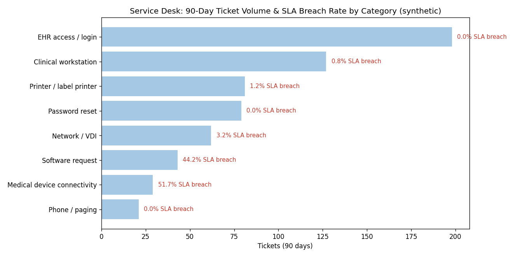

# Healthcare IT Support Toolkit

**Operational runbooks + data-driven service-desk analysis for clinical environments.**



## Overview

Healthcare IT support is different: a stuck session blocks a clinician mid-medication-pass, a password reset done wrong is how breaches start, and every workstation touch happens next to PHI. This toolkit captures how I approach that environment — first as documented, repeatable procedure, then as data.

**Part 1 — Runbooks** ([runbooks/](runbooks/)): three procedures written the way I'd hand them to a new tech:

- [EHR downtime](runbooks/ehr-downtime-procedure.md) — severity classification, downtime workstation activation, HIPAA handling of paper fallback, and the interface-backlog trap that reopens incidents
- [Password reset with identity verification](runbooks/identity-verification-password-reset.md) — the anti-vishing procedure, because the service desk is a hospital's softest target
- [Clinical workstation triage](runbooks/clinical-workstation-triage.md) — session-first troubleshooting to get clinicians working in minutes, with the non-negotiable PHI rules

**Part 2 — Ticket analysis** ([ticket-analysis/](ticket-analysis/)): a 640-ticket synthetic service-desk extract analyzed with Python to answer the manager questions: where does volume come from, what breaches SLA, and what should we automate first? Findings in [findings.md](ticket-analysis/findings.md) — headline: medical-device connectivity breaches SLA on **~52%** of tickets (vendor-dependency problem, not a technician problem), and password resets (~13% of the queue) are fully self-service-able.

**Part 3 — HIPAA quick reference** ([docs/hipaa-quick-reference-for-it.md](docs/hipaa-quick-reference-for-it.md)): daily support actions mapped to the Security Rule controls they touch.

> Ticket data is synthetic and reproducible (seeded). No PHI anywhere in this repository.

## How to run the analysis

```bash
pip install pandas matplotlib
python ticket-analysis/generate_tickets.py
python ticket-analysis/analyze_tickets.py
```

## Skills demonstrated

Clinical-environment support operations (EHR downtime, VDI/roaming sessions, medical-device peripherals) · HIPAA Security Rule applied to daily IT work · service-desk metrics & SLA analysis with Python · runbook/SOP writing · continuous-improvement recommendations backed by data

## About

Built from 4+ years in enterprise technical support, including healthcare IT support for CVS Health's workforce — formalized through the Johns Hopkins Healthcare IT Support specialization.

📫 elazarferrer1@gmail.com · [Profile](https://github.com/elazarf123)
